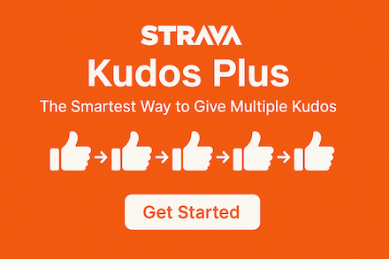

# Strava Kudos Plus

A Chrome extension that allows you to give kudos to multiple Strava activities with a single click.

## Features

- Adds a "Give X Kudos" button to your Strava dashboard, athlete pages, and club feeds
- Automatically identifies activities that haven't received your kudos yet
- Shows you exactly how many kudos you can give at a glance
- Works seamlessly with Strava's interface
- Respects Strava's rate limits to ensure smooth functionality

## Installation

### From Chrome Web Store
1. Visit [Strava Kudos Plus on the Chrome Web Store](#) *(add your extension link when available)*
2. Click "Add to Chrome"
3. Confirm the installation

### Manual Installation (Developer Mode)
1. Download or clone this repository
2. Open Chrome and navigate to `chrome://extensions/`
3. Enable "Developer mode" using the toggle in the top-right corner
4. Click "Load unpacked" and select the `chrome-extension` folder from this repository
5. The extension is now installed and ready to use

## Usage

1. Navigate to your Strava dashboard, an athlete page, or a club page
2. Look for the "Give X Kudos" button at the top of the page
3. Click the button to automatically give kudos to all eligible activities
4. The extension will process each activity one by one

Note: This extension only gives kudos to activities from other athletes. It will not give kudos to your own activities.

## Building from Source

If you want to build the extension from source:

1. Clone this repository
2. Install dependencies with `npm install`
3. Run `npm run build` to create the extension package
4. The built extension will be available in the `chrome-extension` folder

## Privacy Policy

This extension does not collect, store, or transmit any personal data from users.

**What this extension does:**
- The extension operates entirely within your browser
- It only interacts with the Strava website to identify and click kudos buttons
- It does not access, collect, or store any personal information
- It does not use cookies, analytics, or tracking technologies
- It does not communicate with any external servers

**Permissions:**
This extension only requires permission to access and modify content on Strava.com pages, which is necessary for its core functionality of adding and clicking the kudos button.

## Contributing

Contributions are welcome! Feel free to submit a pull request or open an issue if you have ideas for improvements or have found a bug.

## License

This project is licensed under the MIT License - see the LICENSE file for details.